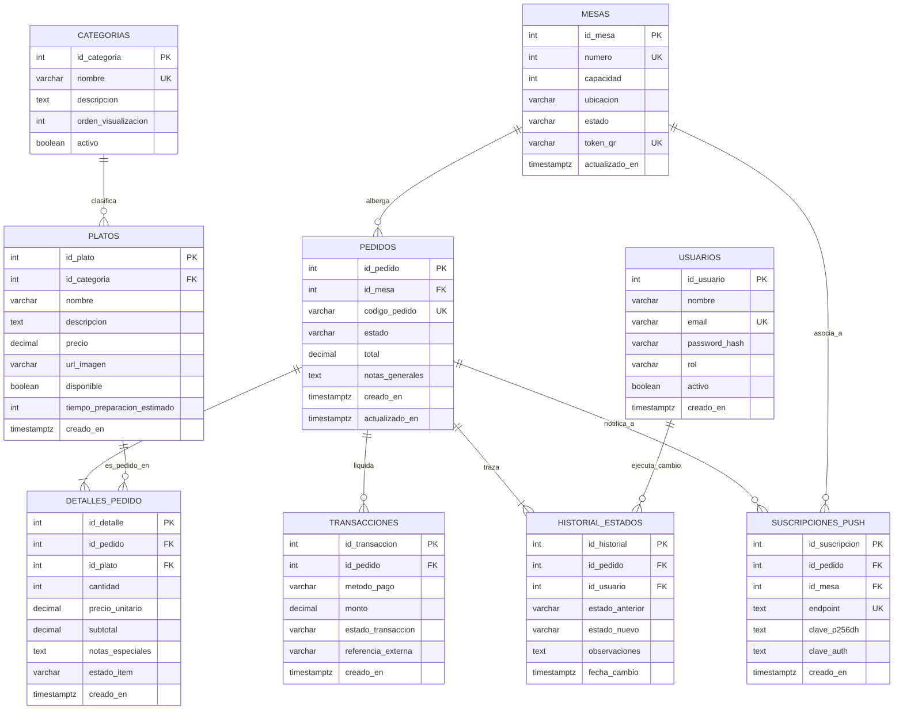

# 📊 Modelo Entidad-Relación (MER) y Diagrama ER (DER) - SmartDining

**Proyecto:** SmartDining - Plataforma Web para Digitalización de Sala y Cocina  
**Módulo:** Base de Datos Relacional (PostgreSQL)  
**Autor y Líder de Datos:** Jarrison Pulgarin (Integrante 2)  
**Nivel de Normalización:** Tercera Forma Normal (3FN)  

---

## 🎯 1. Análisis de Requerimientos y Decisiones de Arquitectura

Como arquitectos de datos, el diseño debe responder a los flujos críticos de la operación en tiempo real:

1. **Inmutabilidad y Auditoría Financiera:**  
   En la tabla `detalles_pedido`, el atributo `precio_unitario` se almacena como una copia congelada al momento de la orden. Si el restaurante sube el precio de un plato en la tabla `platos` al día siguiente, los registros históricos y cierres de caja de días anteriores **no** se alteran.
2. **Ciclo de Vida del Pedido y KDS:**  
   Los estados del pedido (`recibido` ➔ `en_preparacion` ➔ `listo` ➔ `entregado` ➔ `pagado` ➔ `cancelado`) no solo residen en la cabecera `pedidos`, sino que la tabla `historial_estados` almacena cada transición con marca temporal (`timestamp`) y el usuario responsable, permitiendo calcular el tiempo medio de preparación (métrica clave para el KDS).
3. **Control de Mesas y Sesión QR:**  
   Cada mesa cuenta con un `token_qr` único y regenerable. Esto permite invalidar un código QR en caso de que alguien se lo lleve del restaurante o para cerrar sesiones fraudulentas.
4. **Desacoplamiento de Pagos:**  
   La tabla `transacciones` maneja transacciones parciales o métodos mixtos (ej. pagar una parte en efectivo y otra en tarjeta/transferencia), vinculadas al pedido.
5. **Notificaciones Push PWA:**  
   La tabla `suscripciones_push` almacena las credenciales del estándar Web Push API (`endpoint`, `p256dh`, `auth`) para enviar alertas al celular del cliente sin requerir que cree una cuenta obligatoria.

---

## 📐 2. Modelo Conceptual (MER): Entidades y Cardinalidades

- **`USUARIOS` (1) ──── (0..N) `HISTORIAL_ESTADOS`:** Un usuario del personal puede registrar múltiples cambios de estado en los pedidos.
- **`MESAS` (1) ──── (0..N) `PEDIDOS`:** Una mesa física puede tener muchos pedidos a lo largo del tiempo, pero solo uno activo simultáneamente.
- **`CATEGORIAS` (1) ──── (0..N) `PLATOS`:** Una categoría (ej. Bebidas) agrupa muchos platos. Un plato pertenece a exactamente una categoría.
- **`PEDIDOS` (1) ──── (1..N) `DETALLES_PEDIDO`:** Un pedido contiene uno o muchos ítems pedidos.
- **`PLATOS` (1) ──── (0..N) `DETALLES_PEDIDO`:** Un plato puede haber sido solicitado en múltiples detalles de pedido.
- **`PEDIDOS` (1) ──── (0..N) `TRANSACCIONES`:** Un pedido puede pagarse mediante una o varias transacciones de pago.
- **`PEDIDOS` (1) ──── (1..N) `HISTORIAL_ESTADOS`:** Todo pedido tiene un registro cronológico de sus cambios de estado.
- **`PEDIDOS` (0..1) ──── (0..N) `SUSCRIPCIONES_PUSH`:** Un dispositivo cliente puede suscribirse a las notificaciones asociadas a su sesión de pedido o mesa.

---

## 🗂️ 3. Diagrama Físico Entidad-Relación (DER en Mermaid)

---

## 📖 4. Diccionario de Datos Exhaustivo (Las 9 Tablas)

### 1. Tabla: `usuarios`
Personal operativo y administrativo del restaurante.

| Campo | Tipo PostgreSQL | Nulo | Restricciones / Valor por defecto | Descripción |
| :--- | :--- | :--- | :--- | :--- |
| `id_usuario` | `SERIAL` | NO | PRIMARY KEY | Identificador único del usuario. |
| `nombre` | `VARCHAR(100)` | NO | - | Nombre completo del colaborador. |
| `email` | `VARCHAR(120)` | NO | UNIQUE | Correo electrónico para acceso al panel. |
| `password_hash` | `VARCHAR(255)` | NO | - | Contraseña cifrada con algoritmo seguro (ej. bcrypt/argon2). |
| `rol` | `VARCHAR(20)` | NO | CHECK (`rol` IN ('admin', 'mesero', 'cajero', 'cocina')) | Rol asignado para control de accesos RBAC. |
| `activo` | `BOOLEAN` | NO | DEFAULT `TRUE` | Estado lógico para habilitar o suspender acceso. |
| `creado_en` | `TIMESTAMPTZ` | NO | DEFAULT `CURRENT_TIMESTAMP` | Fecha y hora de creación. |

---

### 2. Tabla: `mesas`
Mesas físicas en el salón del restaurante y configuración de códigos QR.

| Campo | Tipo PostgreSQL | Nulo | Restricciones / Valor por defecto | Descripción |
| :--- | :--- | :--- | :--- | :--- |
| `id_mesa` | `SERIAL` | NO | PRIMARY KEY | Identificador único interno. |
| `numero` | `INTEGER` | NO | UNIQUE, CHECK (`numero` > 0) | Número visible en la mesa física (ej. Mesa 1, Mesa 2). |
| `capacidad` | `INTEGER` | NO | DEFAULT 4, CHECK (`capacidad` > 0) | Número máximo recomendado de comensales. |
| `ubicacion` | `VARCHAR(50)` | SÍ | DEFAULT 'Principal' | Zona del restaurante (Terraza, Salón Principal, Barra). |
| `estado` | `VARCHAR(20)` | NO | DEFAULT 'disponible', CHECK (`estado` IN ('disponible', 'ocupada', 'reservada', 'mantenimiento')) | Estado operativo actual de la mesa. |
| `token_qr` | `VARCHAR(64)` | NO | UNIQUE | Token aleatorio seguro (UUID/Hash) incrustado en el QR. |
| `actualizado_en` | `TIMESTAMPTZ` | NO | DEFAULT `CURRENT_TIMESTAMP` | Marca temporal de última modificación. |

---

### 3. Tabla: `categorias`
Clasificación de productos del menú comercial.

| Campo | Tipo PostgreSQL | Nulo | Restricciones / Valor por defecto | Descripción |
| :--- | :--- | :--- | :--- | :--- |
| `id_categoria` | `SERIAL` | NO | PRIMARY KEY | Identificador único de la categoría. |
| `nombre` | `VARCHAR(60)` | NO | UNIQUE | Nombre visible (Entradas, Platos Fuertes, Bebidas, etc.). |
| `descripcion` | `TEXT` | SÍ | - | Breve descripción para el menú web. |
| `orden_visualizacion`| `INTEGER` | NO | DEFAULT 0 | Orden numérico para ordenar las pestañas en el frontend. |
| `activo` | `BOOLEAN` | NO | DEFAULT `TRUE` | Permite ocultar temporalmente una categoría entera. |

---

### 4. Tabla: `platos`
Catálogo de platos, productos y bebidas ofertados.

| Campo | Tipo PostgreSQL | Nulo | Restricciones / Valor por defecto | Descripción |
| :--- | :--- | :--- | :--- | :--- |
| `id_plato` | `SERIAL` | NO | PRIMARY KEY | Identificador único del plato. |
| `id_categoria` | `INTEGER` | NO | FOREIGN KEY (`categorias.id_categoria`) ON DELETE RESTRICT | Categoría a la que pertenece. |
| `nombre` | `VARCHAR(120)` | NO | - | Nombre del plato (ej. Hamburguesa Clásica 200g). |
| `descripcion` | `TEXT` | SÍ | - | Ingredientes y detalles para el comensal. |
| `precio` | `DECIMAL(10,2)` | NO | CHECK (`precio` >= 0) | Precio de venta al público en moneda local. |
| `url_imagen` | `VARCHAR(255)` | SÍ | - | Enlace a la imagen optimizada del plato. |
| `disponible` | `BOOLEAN` | NO | DEFAULT `TRUE` | Switch para marcar si hay existencias o está agotado. |
| `tiempo_preparacion_estimado` | `INTEGER` | NO | DEFAULT 15, CHECK (`tiempo_preparacion_estimado` > 0) | Minutos promedio de preparación para alertas en KDS. |
| `creado_en` | `TIMESTAMPTZ` | NO | DEFAULT `CURRENT_TIMESTAMP` | Fecha de creación del ítem en catálogo. |

---

### 5. Tabla: `pedidos`
Cabecera de las órdenes realizadas por los clientes en una mesa.

| Campo | Tipo PostgreSQL | Nulo | Restricciones / Valor por defecto | Descripción |
| :--- | :--- | :--- | :--- | :--- |
| `id_pedido` | `SERIAL` | NO | PRIMARY KEY | Identificador único del pedido. |
| `id_mesa` | `INTEGER` | NO | FOREIGN KEY (`mesas.id_mesa`) ON DELETE RESTRICT | Mesa donde se originó el pedido. |
| `codigo_pedido` | `VARCHAR(16)` | NO | UNIQUE | Código alfanumérico amigable (ej. `ORD-8492`). |
| `estado` | `VARCHAR(20)` | NO | DEFAULT 'recibido', CHECK (`estado` IN ('recibido', 'en_preparacion', 'listo', 'entregado', 'pagado', 'cancelado')) | Estado global de la orden. |
| `total` | `DECIMAL(10,2)` | NO | DEFAULT 0.00, CHECK (`total` >= 0) | Monto total acumulado de la comanda. |
| `notas_generales` | `TEXT` | SÍ | - | Observaciones globales (ej. "Mesa con niños pequeños"). |
| `creado_en` | `TIMESTAMPTZ` | NO | DEFAULT `CURRENT_TIMESTAMP` | Momento exacto en que se lanzó el pedido. |
| `actualizado_en` | `TIMESTAMPTZ` | NO | DEFAULT `CURRENT_TIMESTAMP` | Última actualización del estado o ítems. |

---

### 6. Tabla: `detalles_pedido`
Líneas de pedido asociadas a los platos solicitados (Relación N:M).

| Campo | Tipo PostgreSQL | Nulo | Restricciones / Valor por defecto | Descripción |
| :--- | :--- | :--- | :--- | :--- |
| `id_detalle` | `SERIAL` | NO | PRIMARY KEY | Identificador de la línea de pedido. |
| `id_pedido` | `INTEGER` | NO | FOREIGN KEY (`pedidos.id_pedido`) ON DELETE CASCADE | Pedido al que pertenece el ítem. |
| `id_plato` | `INTEGER` | NO | FOREIGN KEY (`platos.id_plato`) ON DELETE RESTRICT | Plato solicitado. |
| `cantidad` | `INTEGER` | NO | CHECK (`cantidad` > 0) | Cantidad de unidades solicitadas. |
| `precio_unitario`| `DECIMAL(10,2)` | NO | CHECK (`precio_unitario` >= 0) | **Snapshot:** Precio unitario al momento de ordenar. |
| `subtotal` | `DECIMAL(10,2)` | NO | CHECK (`subtotal` >= 0) | Cálculo: `cantidad * precio_unitario`. |
| `notas_especiales`| `TEXT` | SÍ | - | Personalización (ej. "Sin cebolla", "Término 3/4"). |
| `estado_item` | `VARCHAR(20)` | NO | DEFAULT 'pendiente', CHECK (`estado_item` IN ('pendiente', 'cocinando', 'listo', 'servido', 'cancelado')) | Control individual para la pantalla de cocina (KDS). |
| `creado_en` | `TIMESTAMPTZ` | NO | DEFAULT `CURRENT_TIMESTAMP` | Hora en que este plato en particular fue solicitado. |

---

### 7. Tabla: `transacciones`
Registro de pagos, liquidaciones y auditoría financiera.

| Campo | Tipo PostgreSQL | Nulo | Restricciones / Valor por defecto | Descripción |
| :--- | :--- | :--- | :--- | :--- |
| `id_transaccion` | `SERIAL` | NO | PRIMARY KEY | Identificador único del pago. |
| `id_pedido` | `INTEGER` | NO | FOREIGN KEY (`pedidos.id_pedido`) ON DELETE RESTRICT | Pedido que se está liquidando. |
| `metodo_pago` | `VARCHAR(20)` | NO | CHECK (`metodo_pago` IN ('efectivo', 'tarjeta_debito', 'tarjeta_credito', 'transferencia', 'online')) | Medio de liquidación. |
| `monto` | `DECIMAL(10,2)` | NO | CHECK (`monto` > 0) | Valor pagado en la transacción. |
| `estado_transaccion`| `VARCHAR(20)` | NO | DEFAULT 'completada', CHECK (`estado_transaccion` IN ('pendiente', 'completada', 'fallida', 'reembolsada')) | Estado de la operación de pago. |
| `referencia_externa`| `VARCHAR(100)`| SÍ | - | Código de comprobante de datáfono, pasarela o banco. |
| `creado_en` | `TIMESTAMPTZ` | NO | DEFAULT `CURRENT_TIMESTAMP` | Fecha y hora de cobro. |

---

### 8. Tabla: `historial_estados`
Trazabilidad de eventos, auditoría de tiempos y métricas operativas.

| Campo | Tipo PostgreSQL | Nulo | Restricciones / Valor por defecto | Descripción |
| :--- | :--- | :--- | :--- | :--- |
| `id_historial` | `SERIAL` | NO | PRIMARY KEY | Identificador de auditoría. |
| `id_pedido` | `INTEGER` | NO | FOREIGN KEY (`pedidos.id_pedido`) ON DELETE CASCADE | Pedido monitoreado. |
| `id_usuario` | `INTEGER` | SÍ | FOREIGN KEY (`usuarios.id_usuario`) ON DELETE SET NULL | Usuario que realizó el cambio (NULL si fue el cliente/sistema). |
| `estado_anterior`| `VARCHAR(20)` | SÍ | - | Estado en el que se encontraba la orden. |
| `estado_nuevo` | `VARCHAR(20)` | NO | - | Nuevo estado asignado. |
| `observaciones` | `TEXT` | SÍ | - | Motivo del cambio o notas operativas (ej. "Demorado por falta de insumos"). |
| `fecha_cambio` | `TIMESTAMPTZ` | NO | DEFAULT `CURRENT_TIMESTAMP` | Timestamp exacto para calcular tiempos de atención. |

---

### 9. Tabla: `suscripciones_push`
Credenciales para notificaciones web en tiempo real (Web Push API).

| Campo | Tipo PostgreSQL | Nulo | Restricciones / Valor por defecto | Descripción |
| :--- | :--- | :--- | :--- | :--- |
| `id_suscripcion`| `SERIAL` | NO | PRIMARY KEY | Identificador único de suscripción. |
| `id_pedido` | `INTEGER` | SÍ | FOREIGN KEY (`pedidos.id_pedido`) ON DELETE CASCADE | Pedido al que el cliente está suscrito para recibir alertas. |
| `id_mesa` | `INTEGER` | SÍ | FOREIGN KEY (`mesas.id_mesa`) ON DELETE SET NULL | Mesa física asociada a la sesión del cliente. |
| `endpoint` | `TEXT` | NO | UNIQUE | URL única del servicio push provista por el navegador. |
| `clave_p256dh` | `TEXT` | NO | - | Clave pública del cliente para cifrado de mensajes push. |
| `clave_auth` | `TEXT` | NO | - | Secreto de autenticación del cliente. |
| `creado_en` | `TIMESTAMPTZ` | NO | DEFAULT `CURRENT_TIMESTAMP` | Momento de registro del dispositivo. |
